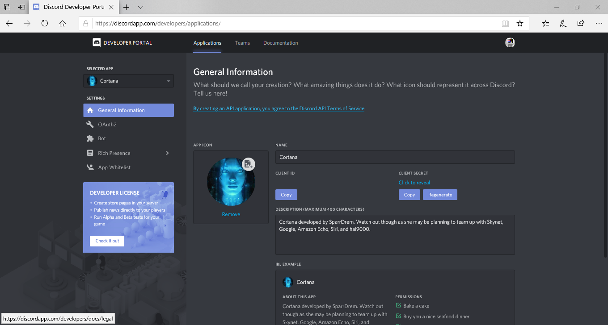

# Cortana BOT for Discord Servers
Cortana bot for Sam&amp;Yoe Group Discord Server

## How do I add Cortana to my Discord server

To add Cortana to your server, you're going to need the following requirements:

* Your Discord Server (not just anyone's discord but yours.)
* Node.js and the NPM manager
* Some fundamental knowledge in JavaScript coding

### Step 1: Setting up the BOT

You will need to create a New Application under the Discord Developer Portal. Click [here](https://discordapp.com/developers/applications/me) to create the application. Name the BOT whatever you want and upload a pretty picture for it too.



Then you'll need to convert your app into a BOT. Click the Bot section and choose the new app you just created under Build-a-Bot. Edit any options you wish to apply to the BOT (public use/permissions/etc.).

### Step 2: Adding the BOT to the Discord server.

If you wish to modify the BOT's permissions, be sure to click Copy before moving on to the next portion of this step. Click New Tab on your browser, and you'll want to copy the following link:

```
https://discordapp.com/oauth2/authorize?&client_id= <ClientID> &scope=bot&permissions= <0>
```

You will need to replace the `<0>` with the number that your permissions generated (if you did not set up any permissions, just set the value to 0) and also replace `<ClientID>` with the client ID (the client ID can be found in General Information). Be sure to remove all spaces in the link you copied. You will be prompted if whether or not to allow the BOT onto the server and which server to add the BOT to. Select the appropriate server for the BOT payload and click Accept. You can close the tab once the process is completed.

### Step 3: Generating the BOT token

Your BOT's token can be found under the Bot section. Copy the token that is generated for your BOT and you will paste it in place of `$dummy_token$` in the file `auth.json`. Be careful with this token that is generated as this key has no encryption/security at all and anybody with the key can modify the BOT to do destructive things to your server.

### Step 4: Running the Payload

Open a Terminal Shell or Command Prompt (CTRL+ALT+T for Linux/BSD systems and CTRL+SHIFT+F10 for Windows) and change directory to the Cortana BOT source. You will need to install the following packages using Node.js Package Manager (NPM) by running these commands:

```
npm install discord.js
```

To start the Cortana BOT

```
node cortana.js
```

And Cortana is activated. The readme.txt file lists all commands currently available to use with Cortana.

## Adding commands to BOT

To add commands, you will need to edit the main JS script `cortana.js`. You will need to provide the name of the command and give the command a fuction. For an example of how to create a new command, see `example-script.js`.

## Downloading the BOT

[Latest](https://github.com/sparrdrem/cortana-bot/archive/master.zip)

### Other BOTs

Dr. Watson is a BOT that handles specific commands (most notably error commands in Windows).

[Dr. Watson](https://github.com/sparrdrem/drwatson-bot/archive/master.zip)
